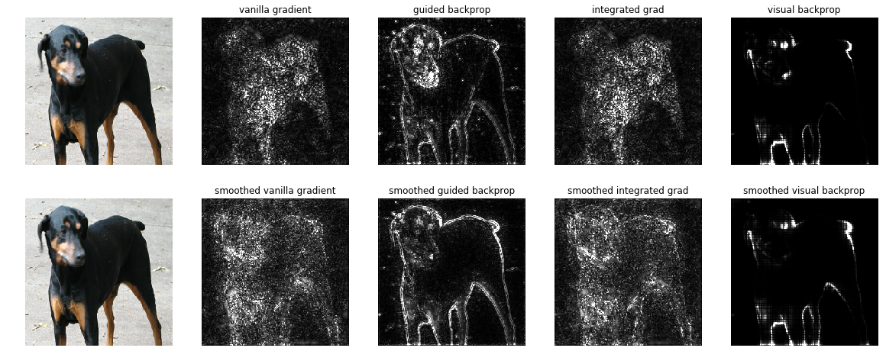
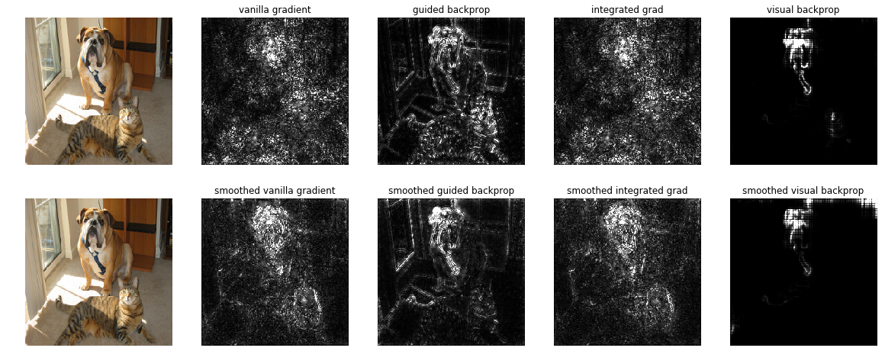

This repository contains the implementations in Keras of various methods to understand the prediction by a Convolutional Neural Networks. Implemented methods are:

* Vanila gradient [https://arxiv.org/abs/1312.6034]
* Guided backprop [https://arxiv.org/abs/1412.6806]
* Integrated gradient [https://arxiv.org/abs/1703.01365]
* Visual backprop [https://arxiv.org/abs/1611.05418]

Each of them is accompanied with the corresponding smoothgrad version [https://arxiv.org/abs/1706.03825], which improves on any baseline method by adding random noise.

Courtesy of https://github.com/tensorflow/saliency and https://github.com/mbojarski/VisualBackProp.

# Examples

* Dog



* Dog and Cat




# Usage

cd deep-viz-keras

```python
from guided_backprop import GuidedBackprop
from utils import *
from keras.applications.vgg16 import VGG16

# Load the pretrained VGG16 model and make the guided backprop operator
vgg16_model = VGG16(weights='imagenet')
vgg16_model.compile(loss='categorical_crossentropy', optimizer='adam')
guided_bprop = GuidedBackprop(vgg16_model)

# Load the image and compute the guided gradient
image = load_image('/path/to/image')
mask = guided_bprop.get_mask(image)               # compute the gradients
show_image(mask)                                  # display the grayscaled mask
```

The examples.ipynb contains the demos of all implemented methods using the built-in VGG16 model of Keras.

# Notes

+ To compute gradient of any output w.r.t. any input https://github.com/experiencor/deep-viz-keras/issues/5#issuecomment-376452683.
